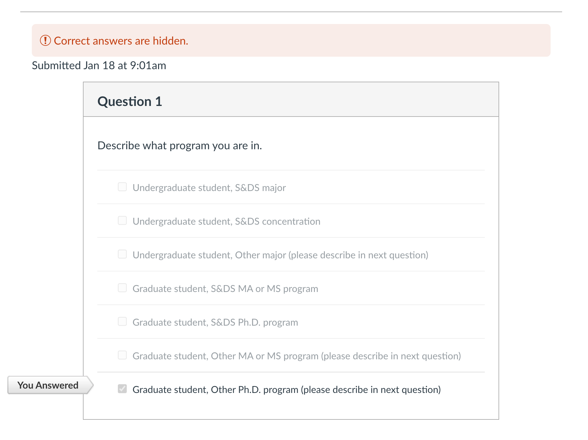
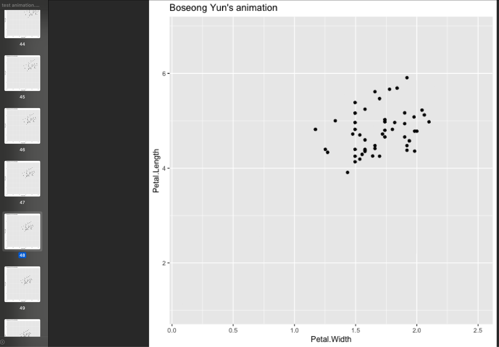
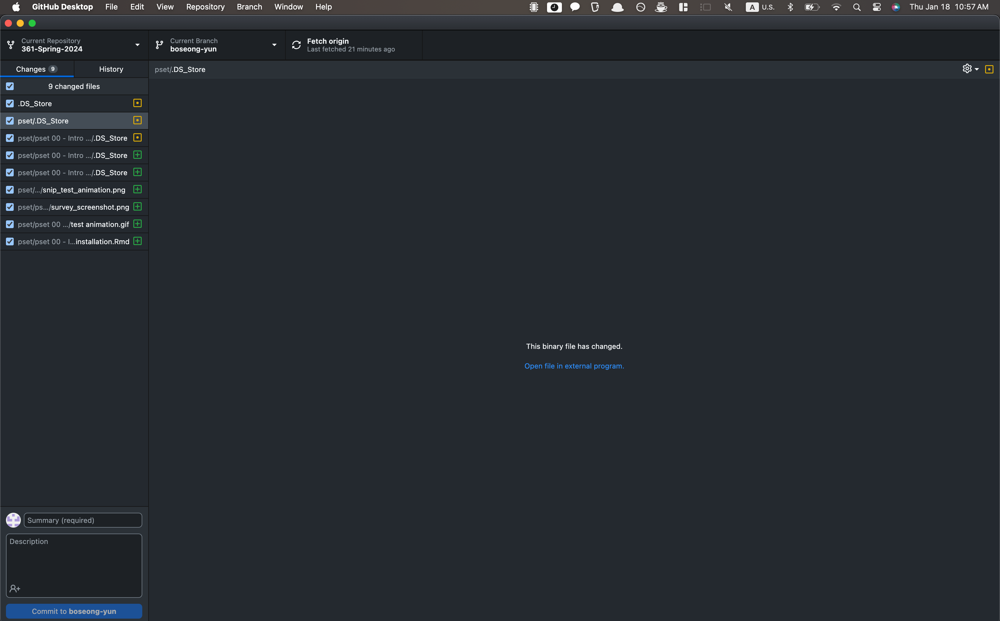
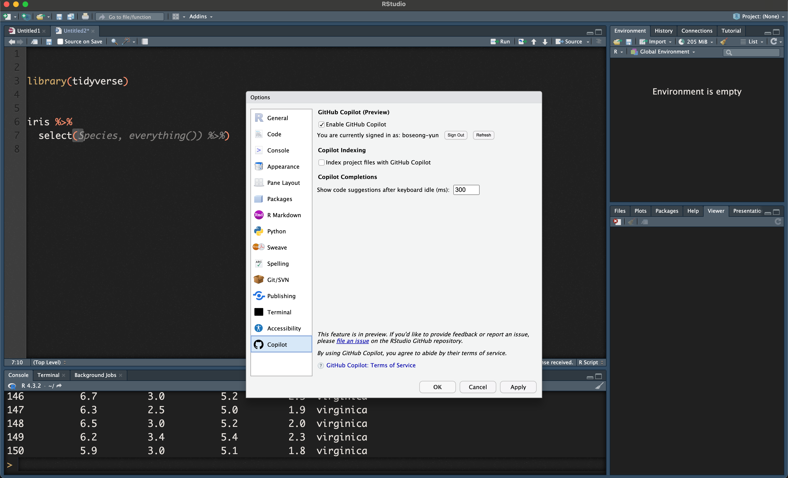

```{r setup, include=FALSE}
library(knitr)

knitr::opts_chunk$set(echo    = T, 
                      include = T,
                      warning = F,
                      message = F,
                      comment = NA,
                      fig.height = 5, 
                      fig.width  = 5, 
                      fig.align  = 'center')
```

## Part 1: Course prep and software installation


#### 1. Complete the Course Survey in the Quizzes section of Canvas  

After you submit the quiz, take a screenshot of the time stamp and Question 1. It should look something like this. 

$\to$ **Answer: The following picture is a screenshot of my survey.**




#### 2. Download and install the latest version of R 

The following code will show your version of R when you knit the document. It should say `R version 4.3.2` or later. Make sure it appears when you knit your document.  

$\to$ **Answer: The following output shows "R version 4.3.2", as desired.**

```{r}
R.Version()$version.string
```

#### 3. Download and install the latest version of RStudio. 

See https://bmacgtpm.github.io/notes/software-installation.html for some potentially useful tips.

This code will show your version of R when you knit the document. Make sure it appears when you knit your document.  It should say `2023.12.0+369` (or later).  

$\to$ **Answer: The following output shows "2023.12.0+369", as desired.**

```{r}
rstudioapi::versionInfo()$long_version
```

#### 4. Install/update packages

See https://bmacgtpm.github.io/notes/software-installation.html for the packages to install. 

Do not write R code for installing packages in this R Markdown. You don't want packages to install every time you knit this document. 

Check that you can load all of the libraries by running this chunk of code and showing that it executes without error. There may be some messages, and maybe warnings about versions. Those are ok. Make sure the output appears when you knit the document. 


$\to$ **Answer: Note that the following code block runs smoothly without any errors.**

```{r error=T, echo = TRUE}
library(knitr)
library(plotly)
library(scales)
library(DT)
library(leaflet)
library(gganimate)
library(gifski)
library(png)
library(corrplot)
library(GGally)
library(ggmap)
library(shiny)
library(MASS)
library(lme4)
library(arm)
library(pROC)
library(MLmetrics)
library(viridis)
library(RSelenium)
library(rvest)
library(randomForest)
library(FNN)
library(caret)
library(pls)
library(devtools)
library(splines)
library(RecordLinkage)
library(rsconnect)
library(grid)
library(foreign)
library(maps) ## leave uncommented. For some reason GitHub Actions had a problem when this wasn't explicitly loaded here. 

## load tidyverse last!
library(tidyverse)
library(pubtheme)
```

#### 5. Check `gganimate`

See https://bmacgtpm.github.io/notes/software-installation.html. The code from that page is below, except a custom title has been added. Replace my name with yours, uncomment the animation code, run all of this code.


$\to$ **Answer: I have (1) replaced the title name with my name, (2) un-commented the animation code, and (3) run all of this code. Note that my animination.gif is saved to the image folder.**

```{r}
# We'll start with a static plot
g = ggplot(iris, 
            aes(x = Petal.Width, 
                y = Petal.Length)) + 
  geom_point() + 
  ggtitle("Boseong Yun's animation")
g

## Commented out (Select the code chunck and press ctrl + shift + c to comment in and out)
# a = g + 
#   transition_states(Species,
#                     transition_length = 2,
#                     state_length = 1)
# 
# ## check that the animation works 
# # save the animation
# anim_save(a, filename = 'img/test animation.gif')
```

$\to$ **Answer (continued): The following is a screenshot of the animation.gif. I have included the sidebar on the left to show more clearly that it is a .gif file.**



#### 6. Bookmarks

See https://bmacgtpm.github.io/notes/software-installation.html. 

$\to$ **Answer: I have visited the website and read the materials. It was through this bookdown website that I was able to find how to download the package `pubtheme` through the devtools library.**


## Part 2: Github

#### 7. Create a GitHub account at <https://github.com/> if you don't have one. Submit your GitHub username in Quizzes -> Course Survey on Canvas.

$$\\[1in]$$

$\to$ **Answer: I have submitted my handle through the survey. My handle: boseong-yun**

#### 8. Download GitHub Desktop at <https://desktop.github.com/>.  

Take a screenshot showing Github Desktop (or different software, or the command line) and show it here. 

$\to$ **Answer: The following picture is a screenshot of my Github Desktop in action.**





#### 9. Clone the repo <https://github.com/bmacGTPM/361-Spring-2024> and create PR as follows.

Clone the repo, create a new branch and name the branch `Firstname Lastname` your first and last name. Make an edit to the R Markdown file `pset00-GitHub-pull-request-Firstname-Lastname.Rmd` to have your name at the top instead of mine. Commit that to your branch, push those commits to GitHub, and create a pull-request to the `main` branch on the 361-Spring-2024 repo. Make the title of the pull request your first and last name. For help getting started, see <https://docs.github.com/en/desktop/installing-and-configuring-github-desktop/overview/getting-started-with-github-desktop>.

$\to$ **Answer: I have (1) cloned the repo and (2) created a new branch `boseong-yun`. (3) I have made an edit to the R Markdown file to have my name at the top instead of mine. (3) Finally, I have committed, pushed, and created a pull-request to the main branch on the 361-Spring-2024 repo with the boseong-yun as the title of my pull request**


#### 10. Set up Github Copilot in RStudio

See https://bmacgtpm.github.io/notes/github-copilot-in-rstudio.html.  


$\to$ **Answer: The following figure shows that (1) my Github Copilot is successfully paired in the system settings and (2) the code preview works as desired in the background :) **




